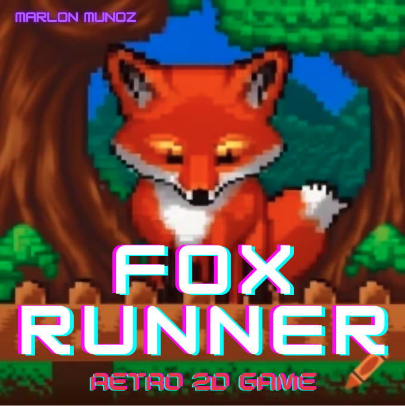
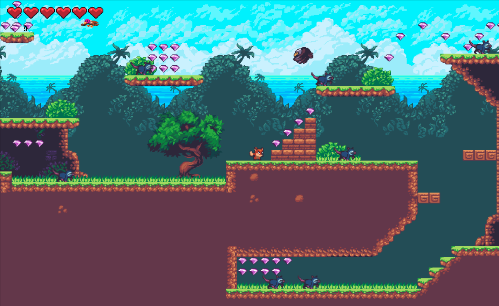

# RETRO FOX RUNNER 
Welcome to Retro Fox Runner

## SETUP
The game is fully functional. This is a retro 2D game. It was my first time getting involved in game development. This was truly the most fun project I've ever built. Hopefully you can hava as much fun playing the game as I had fun discovering and learnign the process of game development. More updates will come as I plan to add more stages and a final big boss. There are a lot of ideas that I plan to implement to make this longer. Enjoy it and happy coding
- `open index.html` 
## Display Game Key Controls

- `Click` anywhere in the screen to start the game
- Press `i` to display in game menu.

## Keyboard Control Instrunctions
- `i` = Display menu controls
- `p` = Pause/Resume game
- `a` = Backwards
- `w` = Jump
- `d` = Fordward
- `space bar` = Rolling Attack

## CREDITS
- Thanks to `ansimuz` for providing the assests
- Thanks to `Chris` for the coding guidance and platform mapper to create the game environment 
- Thanks to `Ben Cavins` for the project aproval
